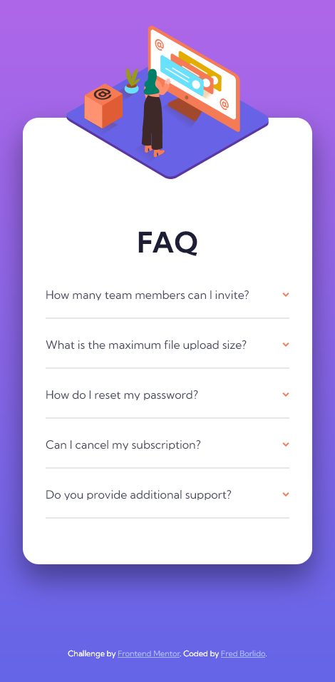
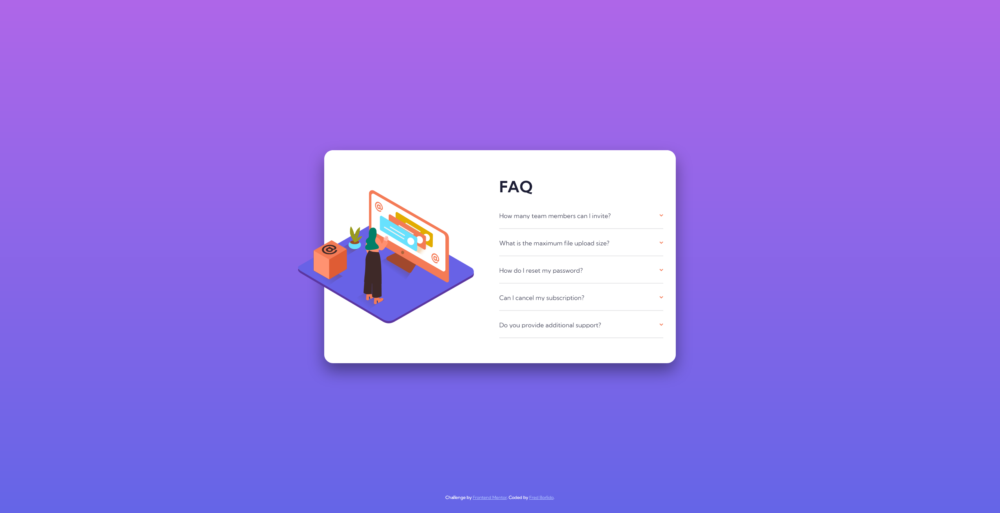

# Frontend Mentor - FAQ accordion card solution

This is a solution to the [FAQ accordion card challenge on Frontend Mentor](https://www.frontendmentor.io/challenges/faq-accordion-card-XlyjD0Oam). Frontend Mentor challenges help you improve your coding skills by building realistic projects. 

## Table of contents

- [Overview](#overview)
  - [The challenge](#the-challenge)
  - [Screenshot](#screenshot)
  - [Links](#links)
- [My process](#my-process)
  - [Built with](#built-with)
- [Author](#author)

## Overview

### The challenge

Users should be able to:

- View the optimal layout for the component depending on their device's screen size
- See hover states for all interactive elements on the page
- Hide/Show the answer to a question when the question is clicked

### Screenshot

- Mobile:

- Desktop:

### Links

- [Solution URL:](https://github.com/fborlido/fm-faq-accordion)
- [Live Site URL:](https://fm-faq-fred.netlify.app/)

## My process

### Built with

- Semantic HTML5 markup
- Sass
- Vite
- Flexbox
- Mobile-first workflow
- [React](https://reactjs.org/) - JS library

## Author

- Website - [Add your name here](https://www.your-site.com)
- Frontend Mentor - [@fborlido](https://www.frontendmentor.io/profile/fborlido)
